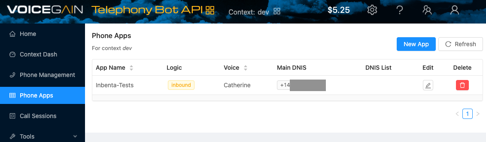

# VOICEGAIN CHATBOT INTEGRATION

### TABLE OF CONTENTS
* [Introduction](#introduction)
* [Features](#features)
* [Building the Voicegain Connector](#building-the-voicegain-connector)
    * [Required Configuration](#required-configuration)
    * [Optional Configuration](#optional-configuration)
	* [ESCALATION (chat.php)](#escalation-chatphp)
	* [CONVERSATION (conversation.php)](#conversation-conversationphp)
	* [ENVIRONMENTS (environments.php)](#environments-environmentsphp)
	* [Deployment](#deployment)
* [Voicegain Configuration](#voicegain-configuration)
    * [Account](#account)
    * [Credit](#credit)
    * [Phone Configuration](#phone-configuration)
    * [Phone App](#phone-app)
    * [JWT Token](#jwt-token)
		* [Create a token](#create-a-token)
		* [JWT Token in Phone App](#jwt-token-in-phone-app)
		* [Token in Voicegain Chatbot Connector](#token-in-voicegain-chatbot-connector)
* [Prepare your Inbenta instances](#prepare-your-inbenta-instances)
    * [Text Content](#text-content)


## **Introduction**
You can extend Inbenta’s Chatbot capabilities to voice with this connector to integrate with [Voicegain](https://www.voicegain.ai/).

## **Features**
The following features of Inbenta’s chatbot are supported in the Voicegain integration:
* Answer Text.
* Sidebubble.
* Multiple options.
* Polar Questions.
* Dialogs.
* Forms, Actions & Variables (Keep in mind we are using voice as a channel. So, not all variable types work best with voice. Example: Email, Date).

## **Building the Voicegain Connector**

### **Required Configuration**

In your UI directory, go to **conf**. Here, you have a readme file with some structure and usage explanations.

Fill the **key** and **secret** values inside the **conf/custom/api.php** file with your Inbenta Chatbot API credentials ([Here](https://help.inbenta.com/en/general/administration/managing-credentials-for-developers/finding-your-instance-s-api-credentials/) is the documentation on how to find the key and secret from Inbenta’s backstage. Use the same credentials as backstage to access the article).

### **Optional Configuration**

There are some optional features (see the list below) that can be enabled from the configuration files. Every optional configuration file should be copied from **/conf/default** and store the custom version in **/conf/custom**. The bot will detect the customization and it will load the customized version. 


### **ESCALATION (chat.php)**

*   **chat** 
    *   **enabled**: Enable or disable HyperChat (“**true**” or “**false**”).
    *   **address**: Phone number that will be used to make the transfer (e.g. ```00000000```)
*   **triesBeforeEscalation**: Number of no-result answers in a row after the bot should escalate to an agent (if available). Numeric value, not a string. Zero means it’s disabled.
*   **negativeRatingsBeforeEscalation**: Number of negative content ratings in a row after the bot should escalate to an agent (if available). Numeric value, not a string. Zero means it’s disabled.


### **CONVERSATION (conversation.php)**

*   **default:** Contains the API conversation configuration. The values are described below:
    *   **answers:**
        *   **sideBubbleAttributes:** Dynamic settings to show side-bubble content. Because there is no side-bubble in Voicegain the content is shown after the main answer.
        *   **answerAttributes:** Dynamic settings to show as the bot answer. The default is [ "ANSWER_TEXT" ]. Setting multiple dynamic settings generates a bot answer with concatenated values with a newline character (\n).
        *   **maxOptions:** Maximum number of options returned in a multiple-choice answer.
    *   **forms**
        *   **allowUserToAbandonForm:** Whether or not a user is allowed to abandon the form after a number of consecutive failed answers. The default value is **true**.
        *   **errorRetries:** The number of times a user can fail a form field before being asked if he wants to leave the form. The default value is 2.
    *   **lang:** Language of the bot, represented by its ISO 639-1 code. Accepted values: ca, de, en, es, fr, it, ja, ko, nl, pt, zh, ru, ar, hu, eu, ro, gl, da, sv, no, tr, cs, fi, pl, el, th, id, uk
*   **user_type**: Profile identifier from the Backstage knowledge base. Minimum:0\. Default:0\. You can find your profile list in your Chatbot Instance → Settings → User Types.
*   **source**: Source identifier (default value **voicegain**) used to filter the logs in the dashboards.

### **ENVIRONMENTS (environments.php)**

This file allows configuring a rule to detect the current environment for the connector, this process is made through the URL where the application is running. It can check the current **http_host** or the **script_name** in order to detect the environment.

*   **development:** 
    *   **type**: Detection type: check the **http_host** (e.g. [_www.example.com_](http://www.example.com/)) or the **script_name** (e.g. _/path/to/the/connector/server.php_).
    *   **regex**: Regex to match with the detection type (e.g. “_/^dev.mydomain.com$/m_“ will set the “development” environment when the detection type is [_dev.example.com_](http://dev.example.com/)).

### **Deployment**
The Voicegain template must be served by a public web server in order to allow Voicegain to send the events to it. The environment where the template has been developed and tested has the following specifications

*   Apache 2.4
*   PHP 7.3
*   PHP Curl extension
*   Non-CPU-bound
*   The latest version of [**Composer**](https://getcomposer.org/) (Dependency Manager for PHP) to install all dependencies that Inbenta requires for the integration.
*   If the client has a **distributed infrastructure**, this means that multiple servers can manage the user session, they must adapt their SessionHandler so that the entire session is shared among all its servers.


# Voicegain Configuration

## Account

Log in to your Voicegain account https://sso.voicegain.ai/login?service=cloud-console:


Or create a new account (https://console.voicegain.ai/signup):


## Credit

Before the bot configuration, you need to add credit to your account. Click on the available Balance, on the left of the gear icon (top menu):


In the next screen, click on **Payment settings** button (another gear icon).


And then, a new window is opened, where you can manage your payment methods:


Once you have added your payment method, go back to the previous screen and now you can add credit to your account:


## Phone Configuration

Once you have enough credit, you need to be sure that you are in the **Telephony Bot API mode**. Click on the four yellow squares icon, on the top and then click on *Telephony Bot API*.


Click on **Phone Management**, on the left menu, and then in **Buy Number** button:


In the newly opened window, search a number by *Area Code*, *Toll Free* or *Location*, select a number and then click **Buy Number** button:


## Phone APP

Once you have a phone number, the next thing to do is to create a new **Phone APP**. Go to **Phone Apps** (left menu) and then click on **New App** button:



Set the name of the App and choose a Voice, also you have to choose a phone number (Main DNIS):


Click on **Add Logic** button (at the bottom of the form of new App). In this new form that opens, select *Logic Type: Inbound*, *Media: Speech* and fill the *Callback URL* (this is where the Voicegain Chatbot Connector is installed):


Click **OK** button and then **Save** to create the App.

## JWT Token

### Create a Token

Once the Phone App is configured, there is an additional step. As as security method to connect to the Voicegain Chatbot Connector, you need to create a JWT Token You can create it visiting: [https://jwt.io/](https://jwt.io/)


In the **PAYLOAD** field, replace the default values and use the next structure (replacing "*personalToken*" with any password-like value that you define):


```json
{
  "token": "personalToken"
}
```

The Algorithm must be **HS264**. The **HEADER** field should look like this:

```json
{
  "alg": "HS256",
  "typ": "JWT"
}
```

Copy the **Encoded** string, it will be used in your Voicegain Phone App.

> The same personal token will be used in the configuration of [Voicegain Chatbot Connector](#token-in-voicegain-chatbot-connector)


### JWT Token in Phone App

Back in the Voicegain Phone Apps screen, click on Edit button icon, in your newly created Phone App:


At the bottom of the opened window, click again in **Edit** button:


And paste the encoded JWT Token, in the **JWT** field:


### Token in Voicegain Chatbot Connector


In the Voicegain Chatbot Connector, in file **/conf/voicegain.php**, you need to add the same personal token that you used to create the [JWT Token](#create-a-token) (replacing "*personalToken*" with any password-like value that you previously defined):

```php
return [
    "token" => "personalToken"
];
```

> Notice 1: Personal token is not the same as JWT Token, the JWT Token is the encoded version of your token using a defined algorithm.

> Notice 2: Personal token is not provided by Inbenta, is any password-like value defined by you.


# Prepare your Inbenta instances

## Text Content

We should always keep in mind that user interaction is going to be through voice. 

Hence, content should be simple text: **avoid the use of HTML tags, multimedia and URLs**. This is especially important if you are using Voice template, most of the HTML tags are not recognized by the TTS (Text-To-Speech) services.

Note: “**Natural Language Search**” is the best **Transition type** for dialogs.
